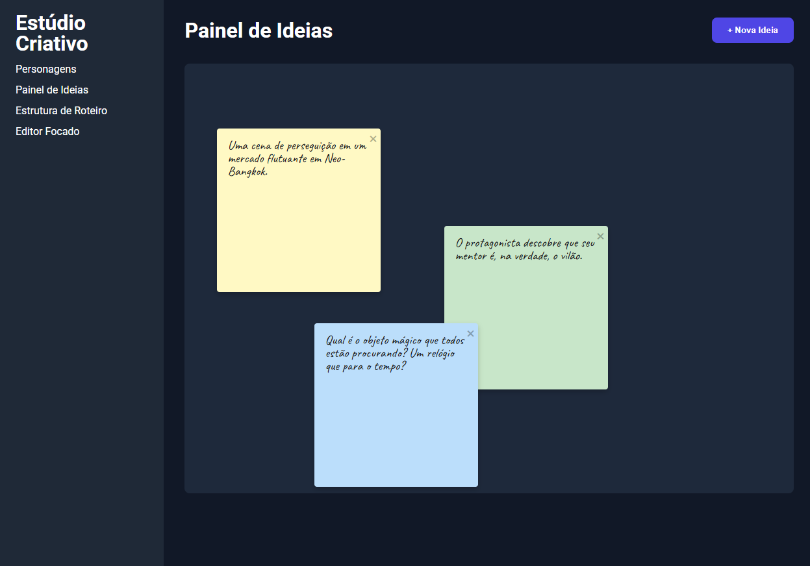

# Estúdio Criativo

<p align="center">
  
</p>

Bem-vindo ao Estúdio Criativo, o seu assistente inteligente de narrativas!

Este projeto é uma ferramenta web projetada para escritores, roteiristas e contadores de histórias. A ideia central não é apenas ser um local para armazenar suas criações, mas uma plataforma que ativamente auxilia no desenvolvimento de narrativas ricas e complexas.

> Uma ferramenta que não apenas armazena suas histórias, mas ativamente ajuda a desenvolvê-las.

## Funcionalidades Planejadas

O Estúdio Criativo está em estágio inicial de desenvolvimento, mas a visão é clara. As funcionalidades planejadas incluem:

- **Painel de Ideias:** Um espaço para brainstorming e organização de conceitos iniciais.
- **Construtor de Personagens:** Crie perfis detalhados para seus personagens, dando-lhes vida e profundidade.
- **Estrutura de Roteiro:** Ferramentas para planejar e visualizar a estrutura de suas histórias.
- **Editor Focado:** Um ambiente de escrita livre de distrações para você se concentrar no que mais importa: a sua história.

## Tecnologias

Este projeto foi construído utilizando tecnologias web modernas para garantir uma experiência de desenvolvimento e de usuário rápidas e eficientes.

- **React:** Para a construção de interfaces de usuário reativas e componentizadas.
- **Vite:** Como ferramenta de build, proporcionando um ambiente de desenvolvimento extremamente rápido com HMR (Hot Module Replacement).

## Como Executar o Projeto

Para executar o projeto em seu ambiente local, siga os passos abaixo:

1.  **Clone o repositório:**

    ```bash
    git clone https://github.com/seu-usuario/estudio-criativo.git
    cd estudio-criativo
    ```

2.  **Instale as dependências:**

    ```bash
    npm install
    ```

3.  **Inicie o servidor de desenvolvimento:**
    ```bash
    npm run dev
    ```

Após executar esses comandos, o projeto estará disponível em `http://localhost:5173` (ou outra porta, se a 5173 estiver em uso).
